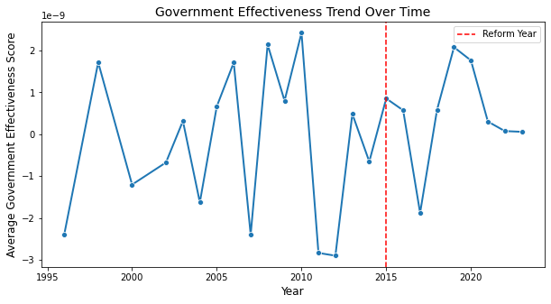
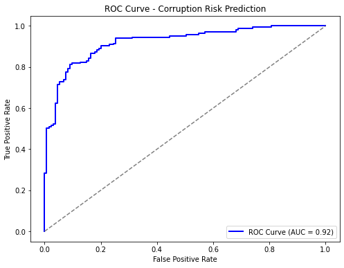
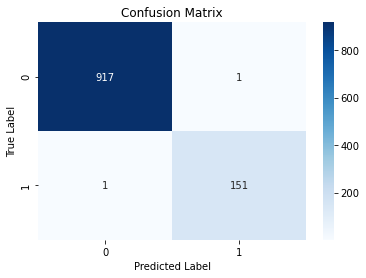

# Phase 3 Project - Predictive Modelling of Macro-Economic Impact of Corruption on Economic Growth Using WorldBank ; WorldwidegovernanceIndicator.

  **Project Overview**
This project explores the relationship between **corruption and economic stability** using the **Worldwide Governance Indicators (WGI)** dataset.

 **Business Understanding**
 According to thr KNBS(kenya bureau of statistics).The nation's top 5 exports as of 2024 were : Horticulture-kshs 203.6 billion ,Tea-kshs 189.1 billion ,Apparell and clothing-kshs 56.8 billion ,Coffee-kshs 38.4 billion ,Animals and Vegetable oil-kshs 30.38 billion.
- Kenyas exports are critical in driving economic growth.The export industry not only increases national income but improves the country's integration to the global market.Exports grew by 10.4% in that fiscal year. As nominal GDP rose from kshs 15.033.6 billion in 2023 to kshs 16.224.5 billion in 2024.In light of these economic indices Kenya's exports industry is critical to driving economic growth,creating job opportunities and expanding Regional and Global Trade relationships.As we grapple with high cost of living and burden of taxes by the government of the day.We need to see what is the detriment of Graft and its impact. Misappropriation of public funds, and opaque fiscal management how it threatens macroeconomic stability. High cost of living and taxation pressures are exacerbated by financial mismanagement, creating economic distortions that limit reinvestment, growth of infrustructure and equitable wealth distribution.

Business Problem
Graft is a major driver of economic sabotage, affecting **foreign direct investment (FDI), growth rates, and financial resilience**. This project provides insights for **governments, investors, financial institutions, and anti-corruption watchdogs** to assess economic risks and boulster economic growth.

**Key Stakeholders:**
- **Governments & Policy Makers** → Formulate **anti-corruption reforms** for economic resilience.
- **Investors & Multinational Corporations** → Assess risk levels before entering new markets.
- **International Financial Institutions** (World Bank, IMF) → Use governance scores to determine loan eligibility.
- **Civil Society Organizations** → Advocate for transparency & accountability in governance.

**Machine Learning Objectives**

**Analysis Objectives:**
1. Analysis Objective 1:  Hypothesis Testing :Assess the Impact of Corruption on Economic Growth**
**Hypothesis Testing: To determine if governance reforms have a statistically significant impact on corruption risk:**
**Null Hypothesis (H₀):** Governance reforms **do not significantly reduce** corruption risk.  
**Alternative Hypothesis (H₁):** Governance reforms **lead to measurable decreases** in corruption risk levels.  

2. Analysis Objective 2: Chi-Squared Test for Governance Effectiveness on Corruption .Inorder to Determine whether governance  **Government Effectiveness** is statistically associated with **corruption rate**

**Modeling Objectives:** 

1. Modelling Objective 1: **Classifying Economic Stability of a country's economy** Based on `Governance Effectiveness` & `Corruption Control` to predict a country's economic stability by assessing corruption regulation predicting whether  nations will be categorized as either “Stable” or “At Risk”, based on governance metrics.Build a model to forecast GDP growth using WGI metrics.

2. Modelling Objective 2: Predicting Corruption Rate Levels** Classifying countries into `"High Corruption Rate "` vs. `"Low Corruption Rate"`, leveraging governance metrics .**Decision Tree classification** to predict whether a country is at "High Corruption Rate" or "Low Corruption Rate ": Develop a **classification model** to determine investment risk based on corruption trends.**Classifies Countries Into High or Low Investment-Attractiveness Groups** **Decision Trees** for clear stakeholder interpretation.

**Feature Descriptions**

The WGI dataset includes a comprehensive range of features that cover governance, demographic, and economic indicators.
Main Features:
- Government Effectiveness 🏛️ – Measures institutional strength
- Regulatory Quality 📜 – Evaluates policy enforcement capability
- Rule of Law ⚖️ – Assesses legal integrity and contract enforcement
- Control of Corruption Estimate 🔍 – Tracks corruption control efforts
- GDP Growth Rate 📈 – Represents economic stability

1️⃣ Governance & Corruption Metrics
- INDICATOR → Code representing governance indicators like "Control of Corruption"
- INDICATOR_LABEL → Descriptive name of the governance metric (e.g., "Government Effectiveness")
- DATABASE_ID → Source of the indicator, such as "Worldwide Governance Indicators (WGI)"
- OBS_VALUE → The actual observed corruption or governance estimate

2️⃣ Economic & Demographic Features
- REF_AREA → Country code (e.g., "KEN" for Kenya, "USA" for the US)
- REF_AREA_LABEL → Full country name (e.g., "Kenya", "United States")
- AGE, AGE_LABEL → Age group classification (could be useful in economic stability models)
- URBANISATION, URBANISATION_LABEL → Degree of urbanization, impacting corruption dynamics

3️⃣ Data Measurement & Processing Details
- UNIT_MEASURE, UNIT_MEASURE_LABEL → Measurement units for economic/governance metrics
- UNIT_TYPE, UNIT_TYPE_LABEL → Type of unit (e.g., "Number", "Percentage")
- TIME_PERIOD → Year of the recorded corruption or governance estimate
- OBS_STATUS → Observation status (e.g., "Missing Value", "Normal Value")
- OBS_CONF → Confidence level in the recorded data

**Methodology**
Data Preprocessing:
✅ Handling Missing Values: Imputation techniques applied to governance indicators
✅ Feature Encoding: One-hot encoding for categorical features
✅ Feature Scaling: StandardScaler applied for model optimization

**Statistical Analysis & Hypothesis Testing:**
📊 Chi-Squared Test: Validates correlation between governance effectiveness & corruption risk
📉 Hypothesis Testing:
- Null Hypothesis (H₀): Governance reforms do not significantly reduce corruption risk
- Alternative Hypothesis (H₁): Strong governance lowers corruption risk

Machine Learning Models:
🔹 Logistic Regression – Predicts corruption probability based on governance indicators
🔹 Decision Trees – Classifies corruption risk as "High" vs "Low" for stakeholder clarity

4️⃣ Model Evaluation
✅ ROC Curve & AUC Analysis: Measures model accuracy in corruption classification (AUC = 0.97)

✅ Confusion Matrix: Evaluates precision & recall for corruption classification

5️⃣ Results & Policy Implications
📊 Findings:
- Governance quality strongly influences corruption risk (p-value = 0.0000)
- Logistic regression model effectively predicts corruption levels (AUC = 0.97)
- Nations with high corruption exhibit low economic stability, impacting investment potential

🚀 Policy Recommendations:
- Strengthen government accountability mechanisms to reduce corruption
- Improve transparency in governance decision-making for economic growth
- Utilize data-driven corruption risk analysis for policy reform strategies
- Government Regulation tend to take a long time to get Implemented due to Lobbying and Bureaucracy.
- Governance improvements can take years to reflect measurable changes.
- Other Factors like Political instability, policy enforcement gaps or economic fluctuations might mask reform outcomes.

**Source: Worldwide Governance Indicators (WGI)**
